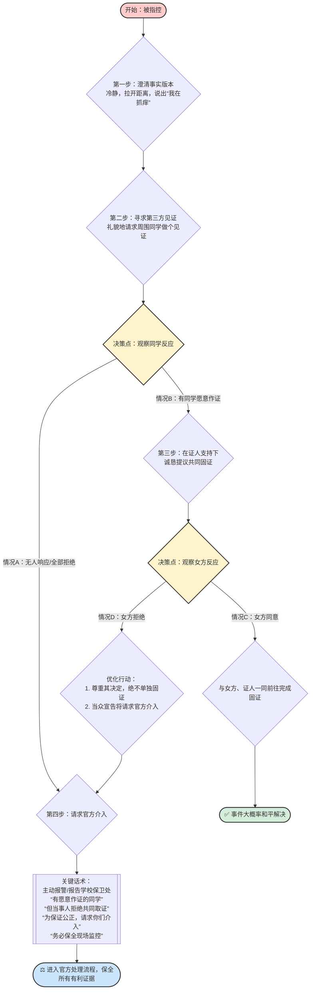

# 危机应对黄金准则流程图

### 流程图解读

这个流程图完整地体现了您制定的“黄金准则”：

1.  **开局稳定**：从 `第一步` 开始，第一时间建立自己的叙事版本。
2.  **引入变量**：`第二步` 引入“证人”这一关键变量，并根据 `决策点：观察同学反应` 将流程分为两条主要路径。
3.  **路径一（无证人）**：如果无人作证，直接跳转到 `第四步：请求官方介入`，避免无谓的纠缠。
4.  **路径二（有证人）**：获得证人支持后，进入 `第三步`，将选择权交给对方，并根据 `决策点：观察女方反应` 再次分流。
    *   **理想情况**：对方同意，事件和平解决。
    *   **关键情况（对方拒绝）**：触发核心的 **风险控制机制**。我方立刻停止现场解决的尝试，转而宣告将引入官方，并直接进入 `第四步`。
5.  **终局收束**：所有复杂情况最终都导向 `第四步`，通过官方力量和预先保全的证据（证人、监控请求）来确保公正裁决，形成完美的逻辑闭环。

### **当代男性公共场所被指控猥亵生存指南**

#### **第一步：澄清事实版本**
*   **行动**：冷静，拉开距离，说出自己的事实版本（“我在抓痒”）。
*   **目的**：第一时间植入“替代性叙事”，避免对方的一面之词成为唯一版本。

#### **第二步：寻求第三方见证**
*   **行动**：当众环视，礼貌地向周围同学（尤其是视角好的）发出请求：“同学，不好意思，这件事对我非常重要，能麻烦您做个见证吗？”
*   **决策点**：观察周围同学的反应。

    *   **情况A：所有人都拒绝或无人响应**
        *   **结论**：无法获得现场中立支持。
        *   **行动**：**直接跳到第四步，立刻请求官方介入。**

    *   **情况B：有同学表示愿意作证**
        *   **结论**：已获得宝贵的中立人证资源。
        *   **行动**：**进入第三步。**

#### **第三步：在证人支持下，向女方提议共同固证**
*   **行动**：在愿意作证的同学面前，再次、诚恳地对女方说：“同学，现在有其他同学愿意帮忙见证，我们一起去卫生间，我向您和大家证明一下，好吗？”
*   **决策点**：观察女方的反应。

    *   **情况C：女方同意**
        *   **结论**：达成共同固证的理想局面。
        *   **行动**：与女方、证人一同前往，完成固证。事件大概率和平解决。

    *   **情况D：女方拒绝**
        *   **结论**：这是最关键的时刻。你拥有了愿意作证的证人，但指控方却拒绝验证。
        *   **行动（优化点）**：
            1.  **绝对不要自己和同学单独去固证！** 这是我们必须规避的风险点。因为它可能被反向解读为“你串通证人，离开了指控方，去制造伪证”。这会给你的完美流程留下一个瑕疵。
            2.  **正确的行动是**：立刻对女方和在场所有人说：“好的，我尊重您的决定。既然我们无法在现场达成一致，但现在有愿意作证的同学，为了最公正地解决问题，**我将立即请求官方介入，并会向他们提供愿意作证的同学的信息。**”
            3.  **然后，直接进入第四步。**

#### **第四步：请求官方介入并保全所有证据**
*   **行动**：自己主动、当众报警和/或报告学校保卫处。
*   **关键话术**：“您好，我在图书馆被指控，现在现场有愿意作证的同学，但当事人拒绝共同取证。为保证公正，我请求你们立刻介入，并**务必保全现场监控**，同时我也会向您提供**在场证人的联系方式**。”

